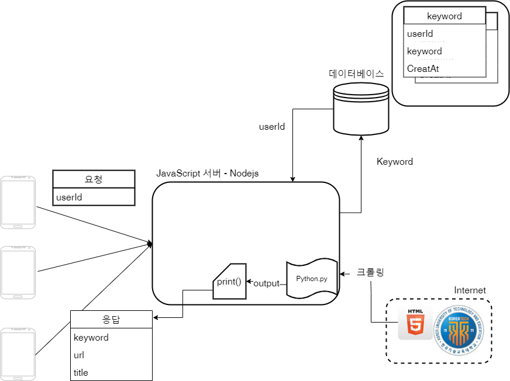

## 백그라운드 키워드 알리미 프로젝트

시스템 구상도

### Nodejs 서버
1. 안드로이드 클라이언트의 요청을 받아 내바 파이썬(크롤링) 스크립트를 실행한다.
2. 결과를 안드로이드 클라이언트에 반환한다.
3. 서버는 데이터 베이스에 데이터를 추가, 삭제, 조회 기능을 가진다.

### Python 요구사항
    1. 서버 내부의 html을 읽어옴.
    2. 새로운 결과 있다면 출력 : [title, url, Date] 
    3. 새로운 결과가 없다면 출력 : ["noResult"]
    4. 가장 최근 공지 고유번호 설정(변화가 없으면 안해도됨.)

#### 참고사항
- Nodejs 환경에서 javascript 로 python 스크립트를 실행하는 방법
  - https://curryyou.tistory.com/225
  